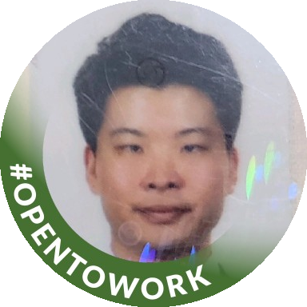

# Hello, I’m James 👋🏻

---

# Software Engineer who has a variety of experience

> *All-round programmer*
I have diverse experience in programming, from web development to monitoring program backend design and setting for cloud environment.
Because of the experience, I was able to develope adaptability and communication skills for other fields. Based on the abilities, I would lik to work in web development / server development / devops.
> 

`Java/Spring`  `JS/TS/React/Vue/Svelte`  `K8s/Docker`

✉️  E-mail : seoungjong@gmail.com
📞  Tel : +82-10-8343-0868

[Linkedin](http://www.linkedin.com/in/seoungjong-yu-346b15299) / [Portfolio](https://telling-cross-9e3.notion.site/Hello-I-m-James-1362f5e8fbf2807cb0bacf2a0cc84cc0?pvs=4)

# 🏆 C A R E E R

---

## **TmaxSoft**

Specialized enterprise software company which offers many softwares such as middleware, mainframe modernization solutions for various system environments, including on-premise and cloud.

Revenue: 156 billion KRW

### 2020.03 ~ 2024.09 (4y 6m)

Position: Frontend Developer

- Desiign and develop some charts and pages for monitoring program with Vue.js
- Develop admin pages for midleware orchestration program with React.js

Position: Backend Developer

- Design and develop monitoring module for midleware orchestration program with Spring framework
- Integrate company’s migration tools with Redhat Application Migration Tool(RHAMT)

📁 Click below to go to the resume.
[TmaxSoft](portfolio/TmaxSoft.md)

Project

- [SuperFrame Master](portfolio/project_portfolio/Superframe_Master.md)
- [T-UP](portfolio/project_portfolio/T-UP.md)
- [Nextrade](portfolio/project_portfolio/Nextrade.md)

# ✍🏻 R E S U M E

---

### 🎓 Education

- **Yonsei University, School of Electrical and Electronic Engineering**  03.2013 - 02.2019
- **Gwacheon Foreign Language High School, Chinese Department Major**  03.2010 - 02.2013 ****

---

### 🚀 Extracurricular Activities

- **Samsung Software Academy for Youth**  12.2018 - 12.2019
Learn Web Development with Java and participate in team project
- **Samsung SDS Special Lecture of Algorithm**  20.08.2018 - 24.08.2018 
Learn data structures and algorithms
- **Yonsei Global**  03.2017 - 06.2018 
Plan programs for exchange students and participate in the programs

Project

- [Healthy Food Website](portfolio/project_portfolio/Healthy_Food_Website.md)
- [Movie Recommendation Website](portfolio/project_portfolio/Movie_Recommendation_Website.md)

# ⚙️ S K I L L S

---

Programming

|Name|Percent|Capability|
|------|---|---|
|Java|⬛️⬛️⬛️⬛️⬛️⬛️⬛️⬛️⬜⬜|80%|
|Spring Framework|⬛️⬛️⬛️⬛️⬛️⬛️⬛️⬛️⬛️⬜|85%|
|Python|⬛️⬛️⬛️⬛️⬛️⬛️⬛️⬜⬜⬜|70%|
|Javascript/Typescript|⬛️⬛️⬛️⬛️⬛️⬛️⬛️⬛️⬜⬜|80%|
|HTML/CSS|⬛️⬛️⬛️⬛️⬛️⬛️⬛️⬛️⬛️⬜|90%|
|React|⬛️⬛️⬛️⬛️⬛️⬛️⬛️⬛️⬜⬜|80%|
|Vue|⬛️⬛️⬛️⬛️⬛️⬛️⬛️⬜⬜⬜|70%|
|Svelte|⬛️⬛️⬛️⬛️⬛️⬛️⬛️⬜⬜⬜|65%|
|Git|⬛️⬛️⬛️⬛️⬛️⬛️⬛️⬛️⬜⬜|75%|
|Jenkins|⬛️⬛️⬛️⬛️⬛️⬛️⬛️⬜⬜⬜|65%|
|Docker|⬛️⬛️⬛️⬛️⬛️⬛️⬛️⬛️⬜⬜|80%|
|Kubernetes|⬛️⬛️⬛️⬛️⬛️⬛️⬛️⬛️⬜⬜|75%|
|Argo|⬛️⬛️⬛️⬛️⬛️⬛️⬛️⬜⬜⬜|65%|
|C/C++|⬛️⬛️⬛️⬛️⬛️⬛️⬛️⬜⬜⬜|65%|

Language

|Name|Percent|Capability|
|------|---|---|
|Deutsch|⬛️⬛️⬛️⬛️⬛️⬛️⬛️⬜⬜⬜|65%|
|English|⬛️⬛️⬛️⬛️⬛️⬛️⬛️⬛️⬜⬜|75%|
|Korean|⬛️⬛️⬛️⬛️⬛️⬛️⬛️⬛️⬛️⬛️|95%|
|Chinese|⬛️⬛️⬛️⬛️⬛️⬜⬜⬜⬜⬜|45%|

---

[▲ Scroll to the Top](README.md)