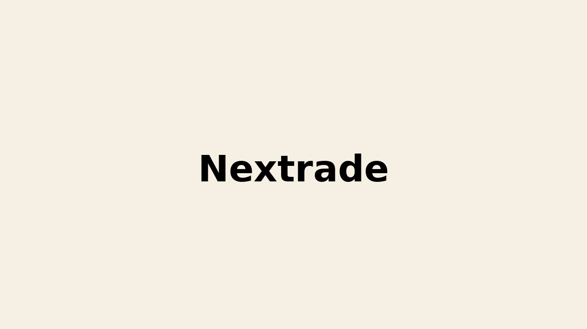

# ☑️ Introduction

A project for developing nongovernmental stock market. In Korea, there is only one stock exchange market, so new stock exchange market is established to encourage competition and provide companies options.

- Project title: Nextrade
- Duration : 11.2023 ~ 05.2023 (6 month)
- Participation rate: 10%
- Main Role : Provide technical support
- Skill Set: Java, Spring Boot, C/C++

---

# ☑️ Project Process

### 1. Receive reports on product bugs

- Receive reports on bugs from the developers of client company
- Reproduce the bugs by analyzing the symptoms and root cause
- Report them to the research lab

### 2. Guide the manual to solve bugs or apply patches

- Provide guidance about the bug to developers
- In the case which can not be solved with guidances, receive patches from lab
- Apply patches to the IDE or develop server

---

# ☑️ Project Result / Assessment

- Completed up to the soft launch stage with the trading system and trading web sites
- Obtain deep understanding about Spring framework and C++
- Experience the development with many third-party products, such as frontend framework, security library, and managing high-volume traffic

[⬅️ To the Main Page](../../README.md)
[⬅️ To the TmaxSoft Page](../TmaxSoft.md)