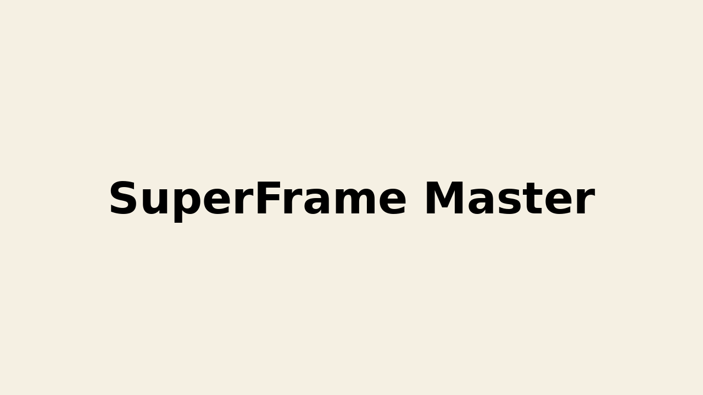

# ☑️ Introduction

Previously, the solutions of Tmaxsoft, such as Jeus(WAS), WebtoB(Webserver), ProObject(Java Framework) were managed by seperate management tools. However, most clients want the integrated product for simple management, so SuperFrame Master, which installs, configures, and monitors the whole products at once, was developed.

- Project title: Superframe Master
- Duration : 03.2022 ~ 10.2023 (1y  7m)
- Number of Members: 30
- Participation rate: 10%
- Main Role : Develop admin pages and monitoring module
- Skill Set: Java, Spring Boot, Javascript, React, Vue

---

# ☑️ Project Process

### 1. Develop Admin Pages

- Develop many configuration pages of the features of Jeus
- Develop LNB logics

### 2. Design and develop alarming part of monitoring module

- Develop configuration of alarming rules with Spring Framework
- Develop the logic for updating alarming rules which is based on the Skywalking

### 3. Develop the frontend part of monitoring module

- Develop configuration pages of setting alarming rules with React
- Develop and update graphs with Vue

---

# ☑️ Project Result / Assessment

- Successfully release Superframe Manager
- Could experience the whole process of developing both in backend and frontend
- Felt that the communication among planners, designers and developers is extremely important to make the project successful

[⬅️ To the Main Page](../../README.md)
[⬅️ To the TmaxSoft Page](../TmaxSoft.md)