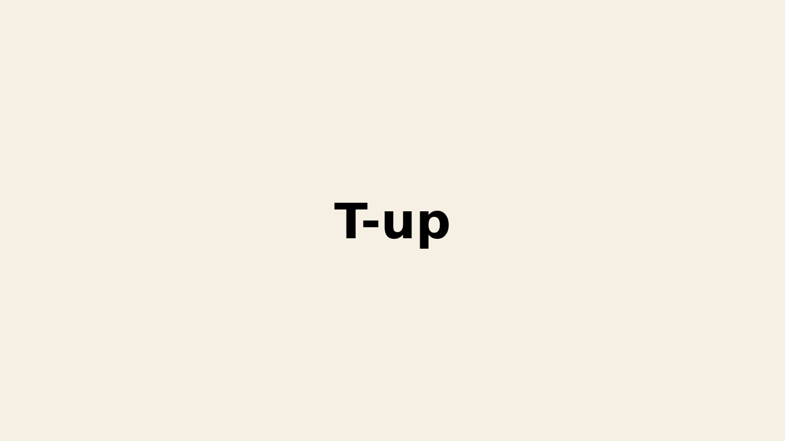

# ☑️ Introduction

There are significant differences between applications targeting different WAS platform. T-UP is for migration to JEUS from other WAS, such as Wildfly, JBoss, Weblogic. 

- Project title: T-up
- Duration : 06.2020 ~ 12.2020 (6 month)
- Participation rate: 40%
- Main Role : Develop the Migration Report generating tool and integrate with previous migration tool
- Skill Set: Java

---

# ☑️ Project Process

### 1. Make Migration Rules for Jeus

- Make java and xml rules to catch some platform-specific methods, classes or annotations and provide hints to fix them

### 2. Modify some report templates

- Analyze the structure and logics how RHAMT makes reports
- Remove some redundant pages of reports and add pages for more information of Jeus

### 3. Integrate report tool with previous migration tool

- Update the previous migration tool which changes the values of setting file automatically
- Integrate the new reporting tool with migration tool

---

# ☑️ Project Result / Assessment

- Succefully integrated the tools and the tool can change the setting files of WAS and make reports about level of effort and the changes to migrate
- Sales part uses the tool to estimate the man-month of migration
- Technical support part uses the tool to change the setting files

[⬅️ To the Main Page](../../README.md)
[⬅️ To the TmaxSoft Page](../TmaxSoft.md)